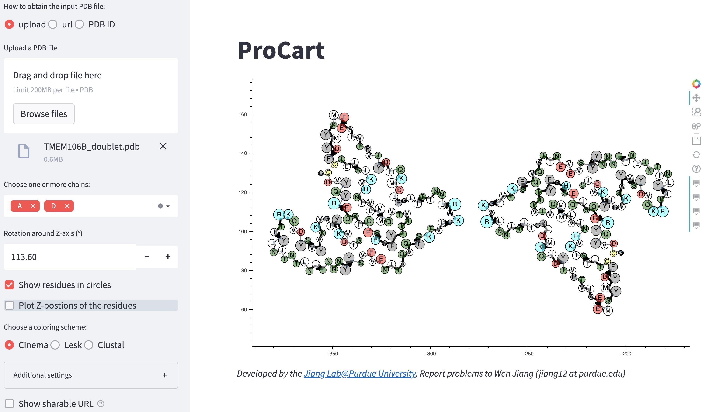

# ProCart
ProCart is a Web app that plots a cartoon to illustrate the residue properties of amyloid proteins in the context of their atomic structures.

Click the link (<a href="https://protein-structure-procart.herokuapp.com">ProCart</a>) to plot a cartoon of your amyloid protein structure!</a>

## Why ProCart?
While the atomic structures of amyloid fibrils, for example, [the structure of Tau filaments from Alzheimer’s disease](https://www.nature.com/articles/nature23002#Fig3) and [the structure of Tau filaments in Prion protein amyloidoses](https://link.springer.com/article/10.1007%2Fs00401-021-02336-w#Fig4), are often presented nicely in XY plane as colored circles around line segments through the Cα atoms, the figures were manually drawn due to the lack of an automated graphic display tool. To eliminate the tedious manual process and to be more quantitative with the positions and sizes of different residues for our new structures of TMEM106B filaments from MSTD, we developed the ProCart method originally as a Google Colab notebook. To make the method more convenient and accessible to all users, we then further developed it into a Web app with some nice features listed below:
## Features
* The backbone is represented as thin line segments connected at the Cα atoms
* The β-strands are represented by thicker lines and an arrow ended at the last residue of the strand
* You can choose a coloring scheme from [three choices (Cinema, Lesk, and Clustal)](https://www.bioinformatics.nl/~berndb/aacolour.html)
* To accurately depict the positions of the residues, the residues are presented as circles positioned at the center-of-mass of the entire residue (including backbone and side-chain atoms)
* To quantitatively illustrate the packing of the residues, the sizes of the circles are proportional to the radius-of-gyration computed for each of the residues
* Mouse hovering over the residues will display the coordinates and the amino acid identity in the tooltips
* The plots can be shared/reproduced via a URL displayed in the browser address bar or a QR code displayed below the plots